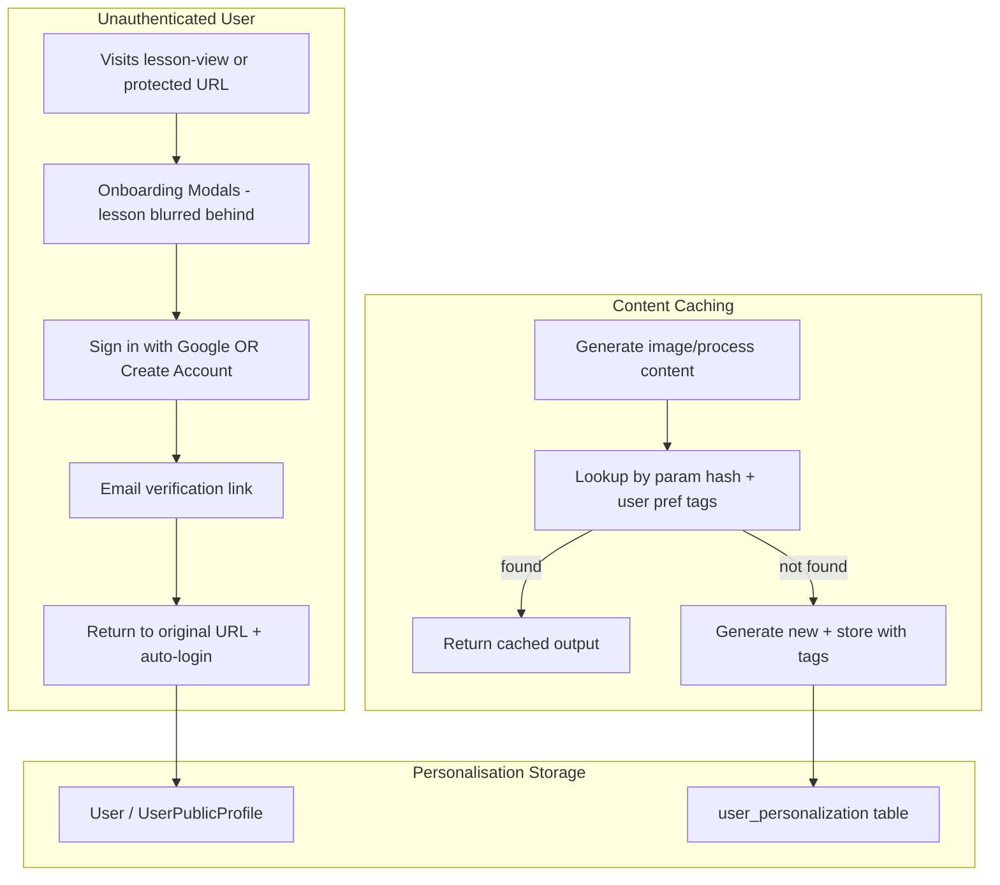

# Authentication, Personalisation Onboarding & Content Caching Plan

**Consolidated Plan** – Merged from Cursor plan versions (f953d97d, 55300801, 83b7570b).

**Workspace:** `c:\Morgan\Coding\Bloomix\BloomixDemo`

---

## Implementation Status (Handoff Summary)

### Done

- **Phase 2 (Personalisation)**: `user_personalization` table, `personalization_options`, UserPersonalizationService, UserPersonalizationController, curated lists (TV/movies, hobbies, learning areas). See `Upora/PHASE2_PERSONALIZATION_COMPLETE.md`.
- **Phase 3 (Onboarding)**: Onboarding flow at `/onboarding` (Welcome → Profile → Interests → Learning → Done), AuthGuard redirect, return URL handling, step components. See `Upora/PHASE3_ONBOARDING_COMPLETE.md`.

### Remaining

| Phase | Description |
|-------|-------------|
| 1 | AWS Cognito Authentication (backend + frontend) – partial JWT strategy exists |
| 4 | Content Caching (param_hash, processed_content_cache, image cache) |
| 5 | Route Protection & UX |
| 6 | Shared User Management (core + Creator Engagement) |
| 6.5 | Messaging |
| 6.6 | Assignments & Deadlines |
| 6.7 | Course Creation UI |
| 6.8 | Groups (Lesson Groups, Course Groups) |
| 7 | Hub System |
| 8 | Notifications |

---

## Current State Summary

**Authentication**

- No real auth: `environment.defaultUserId`, `environment.tenantId`, `environment.userRole` used everywhere
- `x-user-id`, `x-tenant-id` passed via headers from env/localStorage
- [AUTHENTICATION_PLAN.md](AUTHENTICATION_PLAN.md) exists with detailed Cognito design; not implemented
- `docker-compose.yml` has `COGNITO_*` env vars (placeholder values)

**Personalisation**

- **Done**: `user_personalization` table, `personalization_options`, onboarding flow at `/onboarding`

**Content/Image Generation**

- [GeneratedImage](Upora/backend/src/entities/generated-image.entity.ts): stores `prompt`, `lessonId`, `accountId`, `substageId`, `interactionId`, `metadata` - no cache key
- [ImageGeneratorService](Upora/backend/src/services/image-generator.service.ts): always generates; no lookup before generation
- [ProcessedContentOutput](Upora/backend/src/entities/processed-content-output.entity.ts): no parameter hash or cache lookup

**Routing**

- [app.routes.ts](Upora/frontend/src/app/app.routes.ts): AuthGuard redirects to onboarding; lesson-view loads

---

## Architecture Overview



---

## Phase 1: AWS Cognito Authentication

### 1.1 Backend (NestJS)

- Install: `@nestjs/passport`, `passport`, `passport-jwt`, `jwks-rsa`
- Create `AuthModule` with JWT strategy using Cognito JWKS
- Create `JwtAuthGuard`, `RolesGuard`, `@Roles()` decorator
- Create or update `UsersModule` to sync Cognito users (on first login: create/update user by `sub` or email)
- Add `cognitoSub` column to `users` table (migration) if not present
- Apply guards to protected endpoints; keep `x-user-id`/`x-tenant-id` optional for backward compatibility during rollout
- Optional-auth middleware: accept JWT OR headers for gradual migration

**Key files**

- `backend/src/modules/auth/` (auth.module.ts, jwt.strategy.ts, auth.guard.ts, roles.guard.ts)
- `backend/src/common/decorators/roles.decorator.ts`
- Update controllers: lessons, image-generator, interaction-data, etc.

### 1.2 Frontend (Ionic/Angular)

- Install: `@aws-amplify/auth`, `@aws-amplify/core` (or `amazon-cognito-identity-js` if lighter)
- Create `AuthService`: `login`, `signUp`, `signOut`, `currentSession`, `getCurrentUser`, `isAuthenticated`
- Create `AuthGuard`: redirect unauthenticated users; store `returnUrl` in sessionStorage
- Create `/login` and `/signup` routes and components
- Configure Cognito in `environment.ts`: `userPoolId`, `clientId`, `region`
- Update `ApiService` and `InteractionAISDK.getHeaders()` to use JWT from AuthService instead of `environment.defaultUserId`

### 1.3 Cognito User Pool (AWS)

- Create User Pool with:
  - Sign-in: Email
  - Attributes: email (required), name, custom:tenantId, custom:role
  - App client with Secret (if needed) or public client for SPA
  - Enable "Hosted UI" or configure Google as IdP for "Sign in with Google"
- For Email/Password: enable email verification (verification link)
- Configure callback URLs for verification and redirect (e.g. `https://yourapp.com/auth/callback`)

### 1.4 Verification Link & Return URL

- Verification link format: `https://yourapp.com/auth/verify?token=...&returnUrl=/lesson-view/abc123`
- Frontend `/auth/verify` route:
  - Confirm user with token (Cognito `confirmSignUp` or similar)
  - Log user in
  - Redirect to `returnUrl` from query (or `/home` if missing)
- During signup, pass `returnUrl` so verification email can include it (Cognito custom message or Lambda trigger)

---

## Phase 2: Personalisation Data Model & API (DONE)

### 2.1 Database Schema

- **Done**: `user_personalization` table, migration, entity
- **Done**: `UserPersonalizationService`, `UserPersonalizationController` (CRUD, get current user's prefs)
- **Done**: Curated lists seeded (see Phase 2.2)

### 2.2 Curated Lists (DONE)

- **Done**: `personalization_options` table with TV/movies, hobbies, learning_areas
- Stored in `docker/postgres/init/05-personalization.sql`

---

## Phase 3: Onboarding Flow (DONE)

- **Done**: Onboarding route `/onboarding`, steps (Welcome → Profile → Interests → Learning → Done)
- **Done**: AuthGuard redirect, return URL handling
- **Done**: Step components: `onboarding-container.component.ts`, profile, interests, learning, done steps
- See `Upora/PHASE3_ONBOARDING_COMPLETE.md`

---

## Phase 4: Content Caching & Tagging

### 4.1 Goals

- Before generating an image or processed content, check if we already have output for the same **parameters + user personalisation tags**
- If hit: return cached result (avoid LLM cost)
- If miss: generate, store, tag with parameters and user preference tags

### 4.2 Image Cache

**Extend `generated_images` or add cache lookup table:**

- Add `content_hash` (or `param_hash`) column: hash of `{ lessonId, substageId, interactionId, prompt, userInput, customInstructions, personalisationTags }`
- `personalisationTags`: e.g. `["lord-of-the-rings", "sci-fi"]` from user's favourite TV/movies and hobbies
- Add index on `(param_hash, tenant_id)` for fast lookup

**ImageGeneratorService changes:**

1. Before `generateImage`:
   - Build param object including `personalisationTags` from `UserPersonalization` (via userId)
   - Compute `param_hash` (e.g. SHA-256 of sorted JSON)
   - Query `generated_images` WHERE `param_hash = ?` (and optionally `lesson_id`, `tenant_id`)
   - If found: return existing `imageUrl`, `imageId` (no generation)
2. After generation: Store with `param_hash`, `personalisation_tags` (JSONB)

**Fallback when user has no personalisation:** Use `param_hash` without personalisation tags (generic cache) or `param_hash` with empty `personalisationTags`.

### 4.3 Processed Content Cache

**New table `processed_content_cache`:**

```sql
CREATE TABLE processed_content_cache (
  id UUID PRIMARY KEY DEFAULT uuid_generate_v4(),
  tenant_id UUID NOT NULL,
  content_type VARCHAR(50) NOT NULL,
  param_hash VARCHAR(64) NOT NULL,
  source_content_id UUID,
  lesson_id UUID,
  output_reference_id UUID,
  output_type VARCHAR(50),
  personalisation_tags TEXT[],
  created_at TIMESTAMP DEFAULT NOW(),
  UNIQUE(tenant_id, content_type, param_hash)
);
```

### 4.4 Passing Personalisation to Generation

- `ImageGeneratorService.generateImage` and any LLM-based content generator need `userId` to fetch `user_personalization`
- Add `personalisationTags` (or full prefs) to prompt/context for better generation

### 4.5 Image Generation: Key Components with Coordinates (Optional Flag)

- Add `includeComponentMap?: boolean` and `componentPromptContent?: string` to requests
- Store component map in `generated_images.metadata.componentMap`
- Reuse existing image + component map when available; otherwise run LLM on existing image or generate new

### 4.6 Image Dictionary for Simple Words

- Tag images from short prompts (nouns, verbs, adjectives) with dictionary labels
- Lookup image dictionary before generating for simple-word requests
- Storage: extend `generated_images` with `dictionary_labels` or separate `image_dictionary` table

---

## Phase 5: Route Protection & UX

### 5.1 Routes Requiring Auth

- `/lesson-view/:id` – require auth (with onboarding flow)
- `/profile`, `/my-list` – require auth
- `/lesson-builder`, `/interaction-builder`, `/content-library`, `/content-approvals` – require auth + role
- `/super-admin/*` – require auth + super-admin role
- `/hubs/:id/manage` – require auth + hub-admin role for that hub (or super-admin); added in Phase 7

### 5.2 Public Routes (No Auth)

- `/home`, `/categories`, `/search`, `/lesson-overview/:id` – can stay public for browsing

### 5.3 Flag for "Needs Auth"

- Add `data: { requiresAuth: true }` or `data: { requiresOnboarding: true }` on routes
- Guard checks and triggers onboarding flow for unauthenticated users

---

## Phase 6: Shared User Management

**Design principle**: One set of components for user management. No duplicate code. Super admin, hub admins, lesson-creators, and course-creators use the **same views**; features are scoped by `viewerContext.role`.

### 6.1 Viewer Context (Extended)

```typescript
type ViewerRole = 'super-admin' | 'hub-admin' | 'lesson-creator' | 'course-creator' | 'self';

interface ViewerContext {
  role: ViewerRole;
  hubId?: string;
  lessonId?: string;
  courseId?: string;
}
```

- **super-admin**: Full access. Password reset, lesson engagement transcriptions, search across all users visible.
- **hub-admin**: Same UI, scope limited to hub members; super-admin-only sections hidden.
- **lesson-creator**: Engagers of own lessons; can message, mark assignments, set deadlines.
- **course-creator**: Engagers of own courses; same actions as lesson-creator.
- **self**: Logged-in user viewing own data (profile).

### 6.2 Role Scoping Matrix

| Feature | Super Admin | Hub Admin | Lesson Creator | Course Creator |
|---------|-------------|-----------|----------------|----------------|
| User Management (search/list) | All users | Hub members | Engagers of own lessons | Engagers of own courses |
| User Dashboard (detail) | Full | Full (hub scope) | Limited (no password reset, no transcriptions) | Same |
| Messaging users | Yes | Yes (hub members) | Yes (own engagers) | Yes (own engagers) |
| View timeline / progress | Yes | Yes | Yes (own lessons) | Yes (own lessons in courses) |
| Mark offline assignments done | No | No | Yes (own lessons) | Yes (own courses) |
| Set deadlines | No | Yes (hub) | Yes (own lessons) | Yes (own courses) |
| Password reset | Yes | No | No | No |
| Lesson transcriptions | Yes | No | No | No |

**Data sources for engagers:**
- Lesson creator: users with `usages` or `user_interaction_progress` for lessons where `lesson.createdBy = currentUserId`
- Course creator: users who engaged with any lesson in courses where `course.createdBy = currentUserId`

### 6.3 Usage Locations

| Location | Route | Scope | viewerContext |
|----------|-------|-------|---------------|
| Super Admin | `/super-admin/user-management` | All users | `{ role: 'super-admin' }` |
| Hub Admin | `/hubs/:id/manage` (Members tab) | Hub members | `{ role: 'hub-admin', hubId }` |
| Lesson Builder | `/lesson-editor/:id/engagers` | Users who took this lesson | `{ role: 'lesson-creator', lessonId }` |
| Course Creator | `/course-details/:id/engagers` | Users who took lessons in this course | `{ role: 'course-creator', courseId }` |
| User Profile | `/profile` or `/profile/dashboard` | Own data | `{ role: 'self' }` |

### 6.4 Creator Engagement View

- **Component**: Reuse `UserManagementComponent` and `UserDashboardComponent` with `viewerContext.role = 'lesson-creator' | 'course-creator'`
- **Entry points**: Lesson-editor "View Engagers" tab; Course-details "View Engagers" tab
- **Backend APIs**: `GET /lessons/:id/engagers?q=...`, `GET /courses/:id/engagers?q=...`

### 6.5 User Dashboard Data Sections

1. Account & Profile (password reset visible only when `viewerContext.role === 'super-admin'`)
2. Personalisation
3. Personal Settings
4. Lesson Engagement
5. Lesson Progress
6. Interaction Results
7. Usage Metrics
8. LLM Query Usage (reuse `llm_generation_logs`)
9. Other Standard Data
10. Lesson Engagement Transcriptions (super-admin only)
11. Hub Membership

### 6.6 Lesson Engagement Transcriptions

- New table `lesson_engagement_transcriptions`
- Capture from lesson-view: chat, script blocks, interaction events
- API: `POST /interaction-data/session/:sessionId/transcript`, `GET /super-admin/users/:userId/transcriptions`

### 6.7 Backend API

**Super Admin:** `GET /super-admin/users/search`, `GET /super-admin/users/:id/dashboard`, `GET /super-admin/users/:id/transcriptions`, `POST /super-admin/users/:id/send-password-reset`

**Hub Admin:** `GET /hubs/:hubId/members`, `GET /hubs/:hubId/members/:userId/dashboard`

**Logged-in user:** `GET /profile/dashboard`, `GET /profile/llm-usage`

**Shared logic:** `getUserDashboard(userId, { viewerRole, hubId? })` – omit transcriptions and password reset when `viewerRole !== 'super-admin'`.

---

## Phase 6.5: Messaging (Unified with Notifications)

- Messaging is a notification type; same delivery stack (Socket.io, email via N8N)
- Use `notifications` with `type = 'direct_message'`, `from_user_id`, `to_user_id`
- API: `POST /messages`, `GET /messages`, `PATCH /messages/:id/read`
- Permissions: super-admin (any), hub-admin (hub members), lesson-creator (own engagers), course-creator (own engagers)
- UI: "Message" button on user row; modal or `/messages` page

---

## Phase 6.6: Assignments & Deadlines

### 6.6.1 Offline Assignments

- New table `user_assignment_completions`: `user_id`, `lesson_id`, `assignment_key`, `completed_by_user`, `marked_done_by_creator`, `marked_by_user_id`, `marked_at`
- Define checkpoints in `lesson.data.assessment` with `type: 'offline'`
- API: `GET /lessons/:id/engagers/:userId/assignments`, `PATCH /lessons/:id/engagers/:userId/assignments/:key`

### 6.6.2 Deadlines

- New table `user_lesson_deadlines`: `user_id`, `lesson_id`, `course_id` (optional), `deadline_at`, `set_by_user_id`
- API: `GET /users/:userId/deadlines`, `POST /users/:userId/deadlines`, `PATCH` / `DELETE`

### 6.6.3 Timeline View

- Chronological list of `usages` + `user_interaction_progress`; aggregate in backend, no new table

---

## Phase 6.7: Course Creation UI

- **Current state**: `lesson-builder.component.ts` has `createNewCourse()` → `alert('Course creation coming soon!')`; `course.entity.ts` and `lesson.entity.ts` exist; lessons have `courseId`
- **Backend**: Add CoursesModule, CoursesService, CoursesController; endpoints `POST /courses`, `GET /courses`, `PATCH /courses/:id`, `GET /courses/:id/lessons`
- **Frontend**: Replace `createNewCourse()` with modal or route `/lesson-builder/courses/new`; form for title, description; "Add lessons" from creator's lessons; course-details: "Add Lesson" / "Remove from Course"

---

## Phase 6.8: Groups (Lesson Groups & Course Groups)

**Overview**: Lesson-builders and course-creators can create Lesson Groups and Course Groups, invite users, manage group views, post notices, track progress, and manage membership. **Groups are separate from hubs** and accessible from the lesson-builder page.

### 6.8.1 Group Types

- **Lesson Groups**: Groups of users assigned to a specific lesson by a lesson-creator
- **Course Groups**: Groups of users assigned to a course by a course-creator
- **Default Groups**: Each lesson/course automatically has a default group containing all engagers (users who have viewed/interacted). This default group uses the same group management views and messaging as custom groups.

### 6.8.2 Features

- Create Lesson Groups and Course Groups
- **Default groups**: Automatically created for each lesson/course, containing all engagers
- Invite users: email + in-app invite
- Manage group views: Managed Course/Lesson views (filtered content for group members)
- Post notices: rich text, attachments, deadlines, announcements
- Track group progress: aggregate progress per group
- Manage group membership: add/remove members, roles within group
- **Messaging**: Message individual members or broadcast to entire group (reuses Phase 6.5 messaging system)

### 6.8.3 Data Model (Proposed)

- `lesson_groups` / `course_groups`: `id`, `lesson_id` or `course_id`, `created_by`, `tenant_id`, `name`, `is_default` (boolean), `created_at`
- `group_members`: `id`, `group_id`, `user_id`, `role`, `invited_at`, `joined_at`
- `group_notices`: `id`, `group_id`, `author_id`, `title`, `body`, `attachments` (JSONB), `deadline_at`, `created_at`
- Groups are **separate from hubs**; access control is per-group, not per-hub
- Default groups are auto-populated from engagers (usages + user_interaction_progress)

### 6.8.4 Entry Point

- **"Manage Groups" buttons** on lesson and course panels at `/lesson-builder`
- Opens group management view showing:
  - Default group (all engagers) + any custom groups
  - Group member list (reuses UserManagementComponent/UserDashboardComponent patterns)
  - Message buttons for individual members or group broadcast
  - Group notices, progress tracking, membership management
- Course-creator: groups for courses; Lesson-creator: groups for lessons

### 6.8.5 Messaging Integration

- Messaging system (Phase 6.5) is extensible to groups:
  - Message individual group members (same as messaging from View Engagers tab)
  - Broadcast messages to entire group (creates notification for each member)
  - Group management views reuse MessagesModalComponent with group context
- Permissions: lesson-creator can message members of their lesson groups; course-creator can message members of their course groups

### 6.8.6 Open Questions

- Group–hub relationship: Can a group be linked to a hub? (Recommendation: keep groups independent; defer.)
- Notice delivery: Socket.io + email via N8N, same as notifications.

---

## Phase 7: Hub System with Filtered Views

### 7.1 Design Principles

- Unified UI: Netflix-like home; hubs act as filters
- Public hub (default) + tenant/scoped hubs
- Hub switch updates state (RxJS); content re-queries; no full page reload

### 7.2 Data Model

- `hubs`: `id`, `tenant_id`, `name`, `slug`, `is_public`, `owner_id`
- `hub_members`: `id`, `hub_id`, `user_id`, `role`
- `hub_content_links`: `id`, `hub_id`, `lesson_id`, `status`, `released_at`
- `users.can_create_hubs`

### 7.3 Key Features

- Hub switcher; `GET /api/lessons?hub_id=:id`
- Hub manage page at `/hubs/:id/manage`; embeds UserManagementComponent with `viewerContext.role = 'hub-admin'`
- Super-admin: `/super-admin/hub-management`; hub creation page `/hubs/create` for users with `can_create_hubs`

---

## Phase 8: Notifications

### 8.1 Notification Types

| Type | Trigger |
|------|---------|
| New Content Released | Admin releases lesson/course to hub |
| Admin Announcements | Admin creates post via hub manage |
| Progress Reminders | Incomplete lesson after N days |
| Assignment/Score Updates | Admin marks complete or scores interaction |
| Hub Invites/Changes | Invite accepted, role updated |
| direct_message | From messaging (Phase 6.5) |
| assignment_marked_done | Creator marks offline assignment done |
| deadline_reminder | N days before deadline (cron + N8N) |

### 8.2 Data Model

- `notifications`: `id`, `user_id`, `hub_id`, `type`, `title`, `body`, `action_url`, `read_at`
- `hub_posts`: `id`, `hub_id`, `author_id`, `title`, `body`, `metadata`
- `notification_prefs`: `user_id`, `mode`, `email_enabled`, `push_enabled`

### 8.3 Tech Stack

- Socket.io for real-time; NestJS scheduler for reminders; N8N for email

---

## Suggested Implementation Order

1. **Phase 1**: Cognito + basic login/signup + JWT validation (backend + frontend)
2. **Phase 2**: DONE
3. **Phase 3**: DONE
4. **Phase 4**: Content cache (images first, then processed content)
5. **Phase 5**: Apply guards to all protected routes, polish UX
6. **Phase 6 (core)**: Shared User Management – UserManagementComponent, UserDashboardComponent, super-admin tile, backend APIs
7. **Phase 6.5**: Creator Engagement View – engagers APIs, reuse UserManagementComponent
8. **Phase 6.6**: Assignments & Deadlines – tables, APIs, UI
9. **Phase 6.7**: Course Creation UI – Courses CRUD, frontend create/add-lessons flow
10. **Phase 6.5**: Messaging – messages/notifications, compose modal, Message buttons on user rows (IN PROGRESS)
11. **Phase 6.8**: Groups – Lesson Groups, Course Groups, default groups (all engagers), "Manage Groups" buttons on lesson-builder, group management views with messaging integration
12. **Phase 7**: Hub System
13. **Phase 8**: Notifications (full system)

---

## File Checklist

| Area | New/Updated Files |
|------|-------------------|
| Backend Auth | `auth.module.ts`, `jwt.strategy.ts`, `auth.guard.ts`, `roles.guard.ts` |
| Backend Personalisation | DONE |
| Backend Content Cache | Migration for `param_hash`/cache table; `image-generator.service.ts`; `content-cache.service.ts` |
| Backend Phase 6+ | `super-admin-users.controller.ts`, `super-admin-users.service.ts`; engagers APIs; `user_assignment_completions`, `user_lesson_deadlines`; `courses.module.ts`; `POST /messages`, `GET /messages` |
| Frontend Auth | `auth.service.ts`, `auth.guard.ts`, `login.component`, `signup.component`, `auth-verify.component` |
| Frontend Onboarding | DONE |
| Frontend Phase 6+ | `user-dashboard.component.ts`, `user-management.component.ts`; Creator Engagement View; Course create modal; Message compose modal; Groups UI |
| Migrations | `param_hash`/cache; `lesson_engagement_transcriptions`; `users.subscription_renewal_at`; `user_assignment_completions`; `user_lesson_deadlines`; group tables |
| Hubs | `hubs`, `hub_members`, `hub_content_links`; `HubService`; hub switcher |
| Notifications | `notifications`, `hub_posts`, `notification_prefs` |

---

## Open Questions

1. **Lesson-overview vs lesson-view**: Should `/lesson-overview/:id` remain public, with only `/lesson-view/:id` requiring auth?
2. **Google Sign-In**: Cognito Hosted UI (redirect) or embedded Google button?
3. **Personalisation for builders**: Should lesson-builders also go through onboarding? (Assumption: students primary.)
4. **Cache scope**: Per-tenant only, or global for public content?
5. **Messaging model**: Separate `user_messages` table vs. `notifications` with `type=direct_message`?
6. **Course–hub relationship**: Should courses be assignable to hubs?
7. **Groups–hub relationship**: Keep groups independent from hubs?

---

**Last Updated:** February 2025  
**Source:** Consolidated from `c:\Users\Lenovo\.cursor\plans\auth_personalisation_content_cache_*.plan.md`
